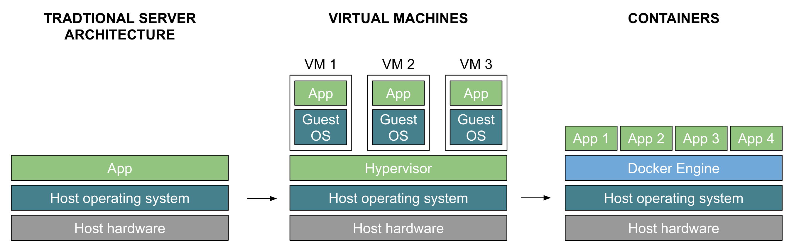
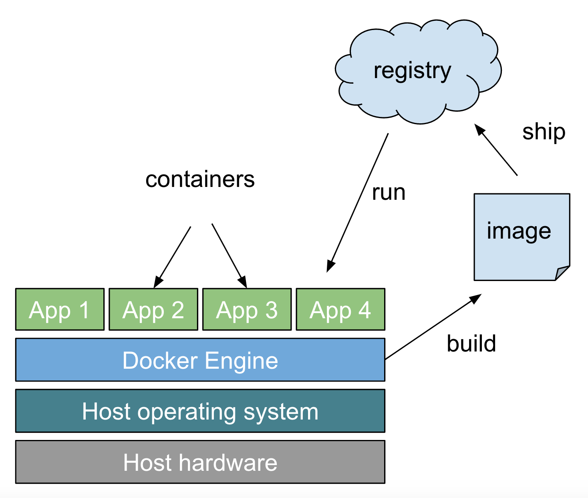
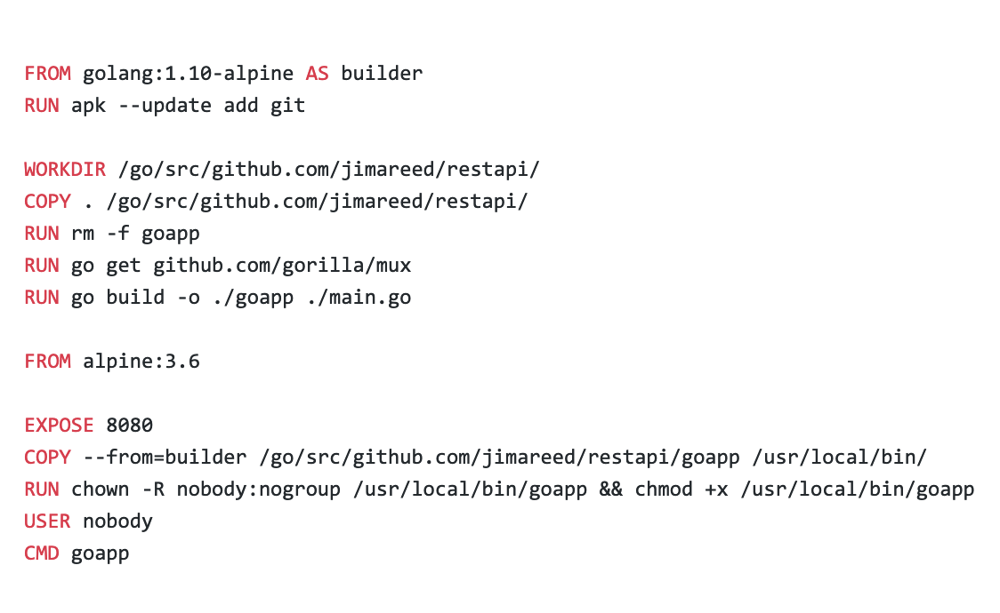
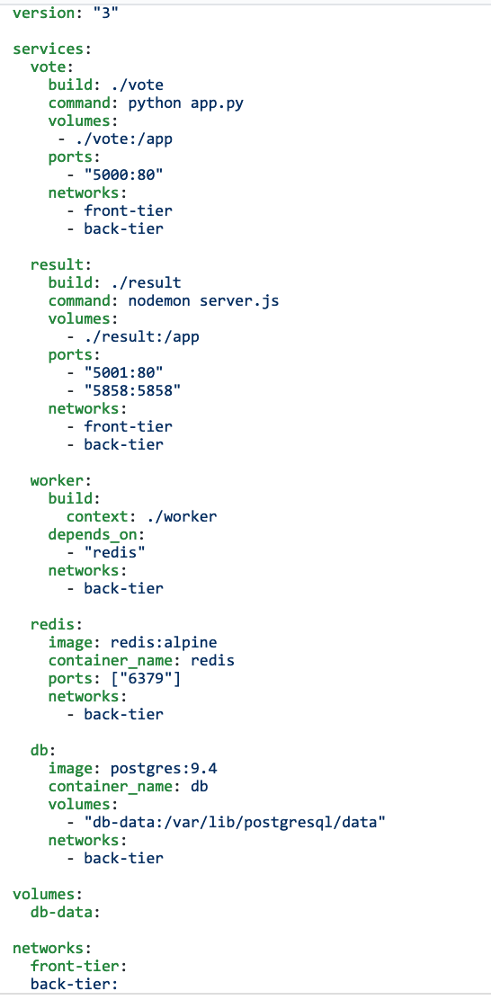

# Intro to Docker


A brief introduction to Docker.  Very high level, designed for beginners.  Here's what we'll cover:
- Before containers
- What is Docker
- Why we like it
- How it works
- Dockerfile
- Build and run a container
- Deploy to Heroku
- Docker Compose
- Orchestration
<br/><br/>
<br/><br/>

## Before containers

- Before VM's and containers, traditional server architecture required large servers that were designed peak load, typically running a single application in production.  
- Common complaint from customers who had large enterprise software deployments:
We've spent millions on hardware but it's normally running at 10% utilization.
- Virtual machines made it much easier to better utilize large servers.  But they still had the overhead that each VM had to run it's own operating system.
- Containers allow you to package only what you need to run your app. 
<br/><br/>


<p  align="center">
    
</p>
<br/><br/>

## What is Docker


- A tool that makes it easy to create, deploy, and run containers.  
- Bundles an application with all of it’s dependencies into a single self contained package.
- Always runs the same way in any environment.
<br/><br/><br/><br/>

## Why we like it
- Build and test the same way on your laptop as in the cloud.
- Super fast to start/stop containers.
- Efficient use of resources.
- Portable, easy to move across cloud vendors.
- Easy to connect containers together so that you can abstract dependencies to other services.
- Well suited for cloud, microservices and continuous delivery.
<br/><br/><br/><br/>


## How it works

Use the Docker Engine to build docker images.  Images can be stored in Docker Registries.  Use the Docker Engine pull images and run them as Docker Containers.
- **Docker Image**\
  application package
- **Docker Container**\
  running application instance
- **Docker Engine**\
  build images and run containers
- **Docker Registry**\
  stores your images
<br/><br/><br/><br/>

## Dockerfile
The Dockerfile contains the spec for building the image.  
<p align="center">

</p>

<br/><br/>
## Build and run a container
Follow the steps below to use Docker to build and run a basic REST API service written in golang.

1. clone the repo https://github.com/jimareed/restapi (and cd into the directory)

2. build the docker image
```
docker build --tag restapi-image .
```

3. run the container
```
docker run --name restapi -p 8080:8080 -d restapi-image
```

4. list the containers to verify the container is running (should see an entry with the image restapi-image and name restapi)
```
docker ps
```

5. test the service, list the fruit
```
curl localhost:8080/api/fruit 
```

returns:
```
[{"id":"0","type":"apple"},{"id":"1","type":"orange"},{"id":"2","type":"pear"}]
```
6. add a fruit
```
curl --header "Content-Type: application/json" \
  --request POST \
  --data '{"type":"banana"}' \
  http://localhost:8080/api/fruit
curl localhost:8080/api/fruit 
```
returns:
```
[{"id":"0","type":"apple"},{"id":"1","type":"orange"},{"id":"2","type":"pear"},{"id":"3","type":"banana"}]
```

7. cleanup the container and image
```
docker stop restapi
docker rm restapi
docker rmi restapi-image
```

<br/><br/>
## Deploy to Heroku
Now that we've build our first Docker container, it is easy to deploy it anywhere.  Here are steps to deploy it to Heroku.

1. Install Heroku CLI: https://devcenter.heroku.com/articles/heroku-cli

2. Pull image from docker hub
```
docker pull jimareed/restapi
```

3. Login to heroku registry
```
heroku container:login
```

4. Create a heroku app (must be unique across Heroku)
```
heroku create --app jimareed-restapi
```

5. Tag image to be deployed to heroku
```
docker tag jimareed/restapi registry.heroku.com/jimareed-restapi/web
```

6. Push container to heroku
```
docker push registry.heroku.com/jimareed-restapi/web
```

7. Create a new release
```
heroku container:release web --app jimareed-restapi
```

8.  Test the app:  https://jimareed-restapi.herokuapp.com/api/fruit

9. Cleanup
```
heroku destroy --app jimareed-restapi
```
<br/><br/>

## Docker Compose
Makes it easy to build and deploy multi-container applications.  Here's an example from https://github.com/dockersamples/example-voting-app

<p align="center">

</p>
<br/><br/>


## Orchestration


- Container management systems.
- Effectively organizes a group of containers across a set of servers.
- Makes sure containers stay up, simplifies their management in production.


